# 基于姿态传感器的颈椎保护系统

小组成员：罗明雄	邝智豪	潘雪焕

> 作品采集头颈部运动时的加速度和角速度数据，利用随机森林算法识别八种头颈部动作（低头、后仰、左转、右转、左侧屈、右侧屈、左回环、右回环）。将PyCharm训练出的随机森林模型部署到STM32F4单片机中运行，上位机使用QT+QML框架开发。

## 1. 项目说明

### 1.1 项目需求分析

作品针对颈椎病的预防，为需要长期伏案工作或者保持低头姿势的用户提供头颈部动作的识别，也可以作为颈肩部功能锻炼的智能辅助，给颈部运动疗法提供数据支撑。具体需求如下：

- **能识别颈部的常见运动。**

- **记录一段时间内颈部的有效运动次数。**

- **上位机显示相关数据以及评估颈椎病风险和预防建议等功能。**

### 1.2 项目文件说明

#### 1.2.1 Hardware

Hardware文件夹内含颈椎保护系统的下位机的电路原理图和PCB文件，使用立创EDA绘制。

#### 1.2.2 Firmware

Firmware文件夹内含STM32F4的代码，使用cubemx+keil。

#### 1.2.3 Sofeware

Sofeware文件夹里分别是pycharm工程和上位机APP工程以及相应的APK文件。

#### 1.2.4 image

image文件夹里是一些APP的页面截图和下位机的实物图。

#### 1.2.5 Docs

相关的参考文件。

## 2. 项目设计方案

### 2.1 设计方案

作品通过电源管理模块为设备充电和供电，通过信号采集模块获取头颈部动作的原始加速度与角速度数据，通过信号控制处理模块对原始数据进行滤波等处理，通过人工智能算法识别头颈部动作，通过无线通讯模块实现数据传输，通过上位机记录和显示相关信息。功能需求和设计目标分为颈椎病预防动作识别、系统硬件设计、基于智能手机的颈椎保护系统（APP）设计三部分。系统功能框图如图所示。

#### 2.1.1 系统硬件设计

本文研发的系统硬件部分包含信号采集模块即姿态传感器模块，信号控制与处理模块，无线通讯模块以及电源管理模块共四个工作模块。整体框图如图所示。

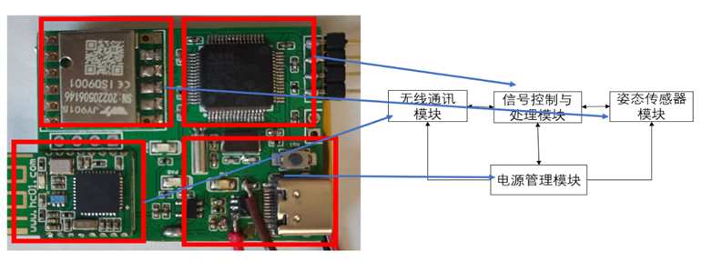

#### 2.1.2 数据集构建

##### 2.1.2.1 实验动作的设计

为了保证各个动作存在一定的区分度，最终确定作品使用的头颈部动作是在多数经临床试验中确实对预防颈椎病或早期颈椎病干预有较明显正面效果的八个动作：

后仰，低头，左转，右转，左侧屈，右侧屈，左回环，右回环。

##### 2.1.2.2 **数据采集方案**

作品的目的是检测头颈部运动，得到头颈部运动信息，可通过检测头颈部运动时的加速度和角速度来实现。装置的目标应用场景是静坐和站立时头颈部的运动，因此不考虑在人的运动过程中（比如上下楼梯时）采集头部运动数据。将传感器固定在头带的左侧，每次采集时尽量保证固定在同一个位置，固定方式见image文件夹。

进行数据采集时，被测人员需要坐在椅子上或站立，保持上半身挺直，肩膀打开，两侧肩膀保持在同一水平线上，下巴内收。采集的动作类型共八种，动作类型编号如表格所示：

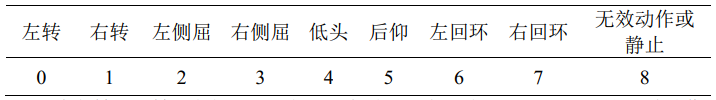

将左转、右转、左侧屈、右侧屈、低头、后仰、左回环、右回环这八种动作规定为有效动作，除此之外不属于这八种的动作规定为无效动作或静止，编号为8。考虑到所采集动作的特点，将蓝牙模块数据发送波特率设置为115200 Bd，姿态传感器模块的采样率设置为50Hz。采集动作时，在15s内做7次动作，即15s为一条数据。

##### 2.1.2.3 数据预处理

- **滑动均值滤波**

本系统中，由于采集信号中的随机噪声属于高频噪声且根据固定动作存在一定周期性规律，同时兼顾软件实现的复杂度，因此采用均值滤波器进行滤除，窗宽设置为 10。

低头动作**未经过**滑动均值滤波的数据（加速度）：

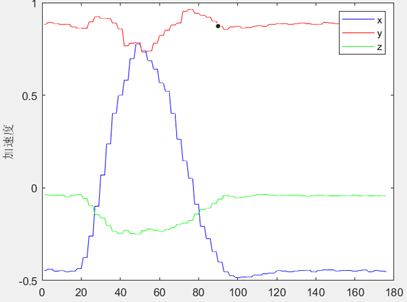

低头动作**经过**滑动均值滤波的数据（加速度）：

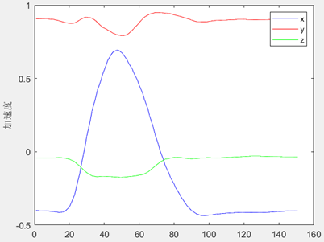

- **去除重力加速度**

数据采集过程中，三轴加速度的大小与该地的重力加速度、传感器的摆放位置、佩戴者的佩戴方式及动作习惯等因素均有关。理想状态下，将加速度传感器水平放置时，与地面垂直的轴输出应为±g，正负与其方向相关，而另外两个轴的输出应为 0。然而在实际测量中，加速度计的摆放不可能完全与地面垂直，会出现一定程度的竖直分量的倾斜。因此需要使用静态误差补偿的方式对测得的加速度数据进行校正。本文利用采集数据过程中的静止状态的重力加速度来校正该问题。

对于独立动作数据而言，有效动作之外的部分可以看作静止状态。因此，将动作开始前的静止段与动作完成后的静止段拼接并取平均值，即可近似获得静止状态时的三轴加速度，即重力加速度在 x 轴、 y 轴、 z 轴的加速度分量。因此，将三轴各数据点减去对应轴的加速度分量，便去除了重力加速度的影响。重力加速度去除算法的效果如图。

低头动作**未去除**重力加速度处理效果：

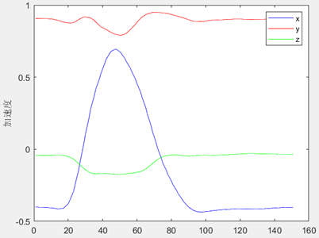

低头动作**去除**重力加速度处理效果：

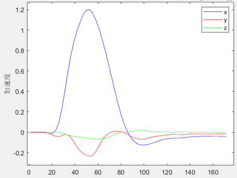

> 可以看到去除重力加速度后 x、y、z 轴三轴加速度起始和结束都基本趋近于 0，比较有利于去除摆放倾斜或加速度计本身的干扰。

经过滑动滤波和去除重力加速度后，连续多个低头动作的加速度和角速度如图

连续低头动作（加速度）：

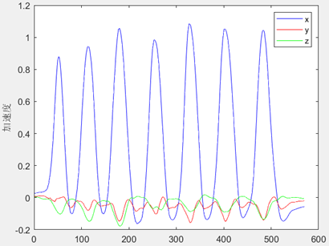

连续低头动作（角速度）：

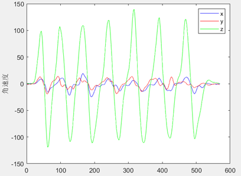

##### 2.1.2.4 数据切割

在上述数据处理过程中，注意到数据是随时间连续变化的，时间上相邻的数据具有较强的相关性。为了充分考虑两段相邻时间数据的相关性，以3s为一个数据，一条数据为15s，以50%重叠率对数据进行切割，即一条数据可切割成9个数据。数据切割如图所示。

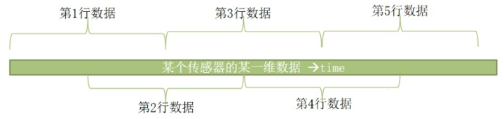

##### 2.1.2.5 特征值的选取

切割后的数据不是所有维度都是有意义的，训练集仅需保留对结果影响较大的维度，因此对切割后的数据集进行特征提取，可在降低输入维度的同时有效提高识别算法的运行速度，为后续将训练出的模型部署到STM32上打好基础。

- **初步选取特征值**

对数据提取时域和频域上的特征，初步选取了最大值、最小值、均值、中值、中值绝对偏差、标准差、偏度、峰度、四分位数范围、能量度量这10种特征值。

- **筛选特征值**

最终模型将会部署到STM32上，因此考虑到计算量，决定通过方差选择法，对提取12种特征进行筛选。

方差选择法的结果如表格所示。由表格可得，最大值、最小值、均值、标准差、能量度量以及时域信号的偏度的方差较大，有较好的分类效果。考虑到STM32上实现特征提取函数的复杂度，最终决定选取最大值、最小值、均值、标准差、能量度量五种特征值。

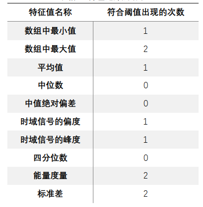

#### 2.1.3 颈椎病预防动作识别算法研究

这一部分完成了三种算法对颈椎病预防动作识别的研究，直接给出混淆矩阵的表现。

##### 2.1.3.1 支持向量机

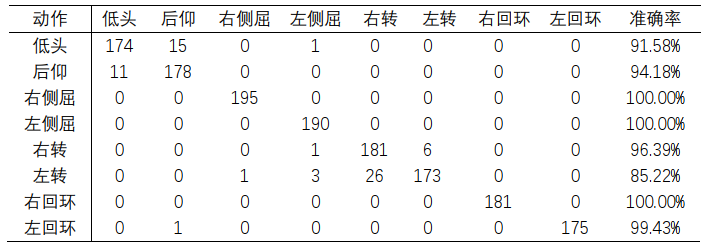

左转头的识别率较低，易与右转头混淆， 其余动作都达到90%以上。最后经过计算，基于 linear 核函数的 SVM 算法对八个动作的平均识别率达 95.70%。

##### 2.1.3.2 全连接神经网络

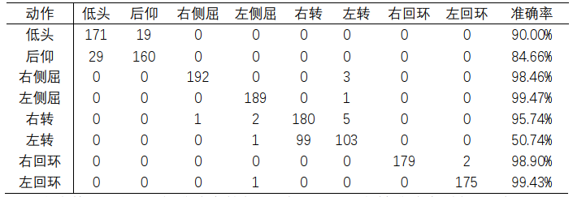

仰准确率较低，只有84.66%，左转准确率最低，只有50.74%，其余动作准确率都在90%以上，其中后仰易于低头混淆，左转易于右转混淆。最后经过计算，全连接神经网络算法对八个动作的平均识别率达 89.22%。神经网络表现不好的原因猜测是数据集过小。

##### 2.1.3.3 随机森林

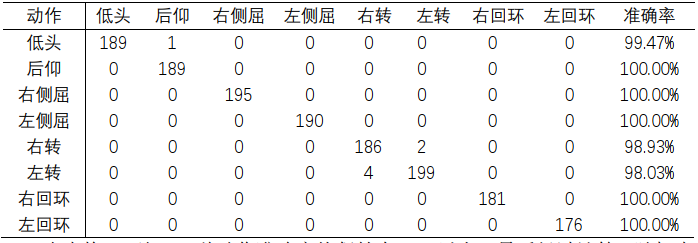

8种动作准确率均保持在98%以上，最后经过计算，随机森林算法对八个动作的平均识别率达 99.54%。

> 考虑到准确率、算法复杂度以及在STM32上的运行速度，最终选择随机森林算法模型作为本作品使用的模型。

##### 2.1.3.4 随机森林模型部署

将每个决策树图形化输出，用c语言描述每个树的结构，统计每个树的输出结果，并以输出动作类型次数最多的动作作为整体输出。如图为其中一棵决策树的结构。

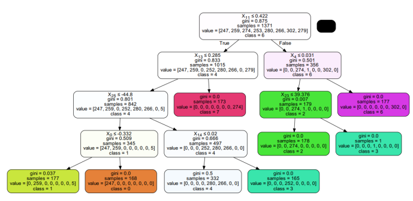

> 综上所述，STM32的数据变化流程图如图所示
>
> 

#### 2.1.4 颈椎保护系统上位机设计

##### 2.1.4.1 系统整体设计

本作品的上位机以Android智能手机为载体，主要功能有：设备连接、动作指导、蓝牙数据传输、数据记录、风险评估及建议等。使用C++语言在QT + QML框架中开发，下位机将分类结果通过蓝牙模块发送到手机APP，手机端获取分类结果并统计一段时间内有效颈椎病预防动作的类别和次数，用于评估颈椎病发病风险并给出运动建议。

##### 2.1.4.2 系统功能设计与实现

上位机由个人中心，动作识别，数据统计三个功能页面组成，其整体结构图如图所示

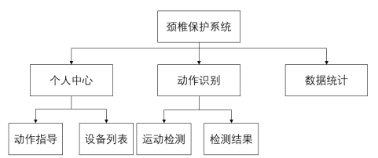

- **个人中心**

个人中心页面分为动作指导和设备列表，其中动作指导用于规范使用者的头颈部动作，设备列表用于搜索和连接蓝牙设备。

- **动作识别**

动作识别页面的上方显示八种有效头颈部动作的次数，下方可显示每次识别的结果。

- **数据统计**

数据统计页面可显示历史统计记录，通过当天的有效动作次数评估颈椎病风险并给出建议。评估方案如表格所示。

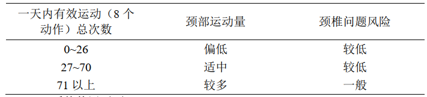

##### 2.1.4.3 系统使用页面

见image文件夹

### 2.2 测试方案

设备使用3.7V，容量为450mAh的锂电池供电。测试者将设备佩戴于头上，待手机上位机发出开始识别指令，测试者开始随机地做不同的动作，当手机上位机发出停止识别指令，测试者停止做动作。为体现随机性，将有两名测试人员先后进行测试。手机上位机上将显示8种动作各自的运动次数。

### 2.2.1 测试结果

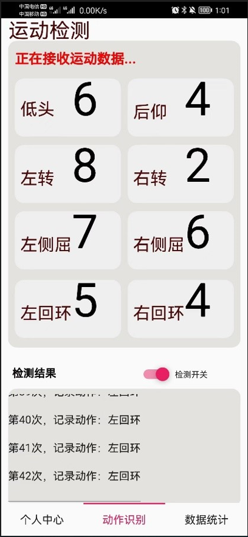

### 2.2.2 结果分析

低头、仰头、右侧屈、左侧屈、右回环、左回环识别准确率较高，右转与左转易混淆，准确率较其余动作没这么高，但也保持在90%以上。设备可正常充电，充满电后，容量为450mAh的锂电池至少可持续使用1.5小时，超过1.5小时后会由于供电电压不足，设备运行出现异常。上位机功能正常，可记录并显示动作运动次数。

### 3. 作品展示

作品图片见image文件夹

### 4. 总结与展望

本文设计并实现了基于姿态传感器的颈椎保护系统，通过姿态传感器采集头颈部运动数据并利用随机森林算法进行动作分类，最终在手机APP上记录并显示颈椎运动情况，以达到日常预防颈椎病的目的。

主要研究内容包括：

- 头颈部动作识别硬件系统设计。本系统硬件部分包含信号采集模块，信号控制与处理模块，无线通讯模块以及电源管理模块。能够将设备便携地佩戴于使用者的头部，提取头部与颈部的动作数据，结合不同颈部运动对动作数据进行综合分析。

- 实验动作设计。经过对颈部肌肉的生理基础考察和各类颈椎病预防治疗文献的调研，确定本研究采用的颈椎病预防动作：端坐在椅子上或站立，分别做低头、后仰、左转头、右转头、左侧屈、右侧屈、左回环、右回环8个动作。

- 数据预处理及数据集构建。按照上述8个动作采集数据集，并进行滤波去噪、去重力加速度、数据分割、特征提取等处理，以便进行后续STM32端头颈部动作的实时识别分类。

- 动作识别算法研究。将处理后的数据分别用基于支持向量机、全连接神经网络、随机森林的方式进行颈椎病预防动作的分类识别，最终分类准确率分别为95.70%、89.22%和99.54%，并且训练后的模型部署到STM32上同样具有良好表现，综合来看结果比较理想。

- 上位机APP设计。该APP与硬件系统通过蓝牙模块连接，能实时接收头颈部动作类别，统计整理一段时间内有效颈椎病预防动作次数，用于评价颈椎运动情况。

 

由于时间和精力有限，在完成以上工作的基础上，本作品还存在许多不足，以及要进一步完善的方面：

- 使用更大的实验样本。本文采用的算法具有一定的统计学特征，需要经过特征工程，然而由于环境和人员的限制，本文的实验种类可能不够全面，且参与实验数据采集的均为小组成员。如需进一步提高算法准确度和普适性，应采用更大的实验样本。

- 对于低功耗低成本的研究。由于采用的蓝牙模块和姿态传感器模块均为集成模块，成本与功耗较高。可自行设计蓝牙与传感器模块来降低成本与功耗。

- 分类器的选择。本文采用了基于支持向量机、随机森林和全连接神经网络进行动作识别分类，还可以尝试其他分类方法，如K近邻、朴素贝叶斯，或者一些无需经过特征工程的算法，如卷积神经网络等方法。

- 模型的训练与部署。本文所用数据集只包含预先采集好的，为了考虑每个用户的动作差异，可采集用户的数据集结合已有数据集训练模型。并且本文只将实验结果准确率最高的随机森林模型部署到STM32上，未尝试支持向量机、全连接神经网络的效果。另外，由于随机森林模型是使用C语言实现的，同样可部署到上位机中，进一步减低成本和功耗。